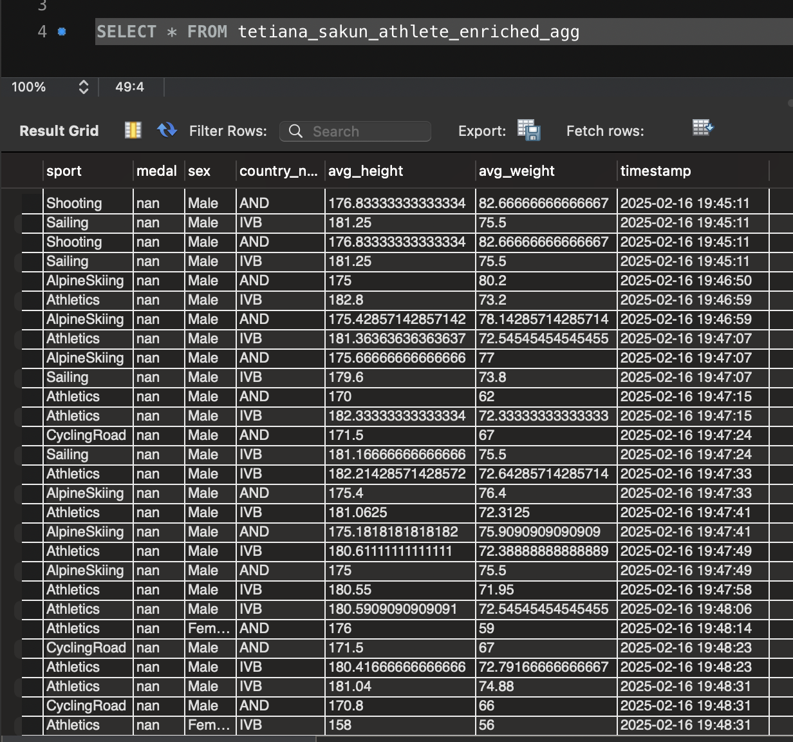
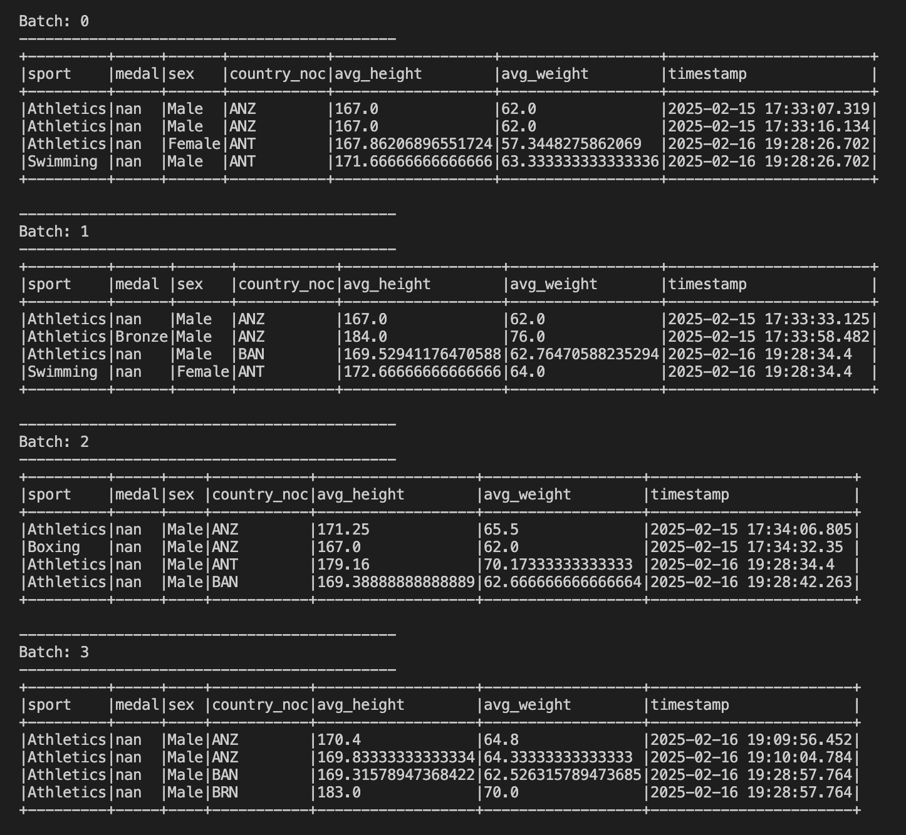
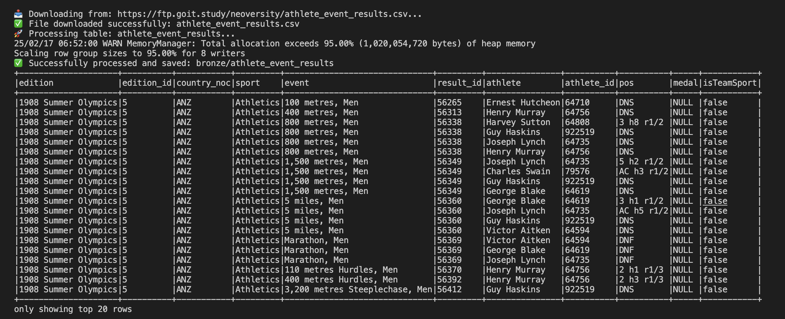
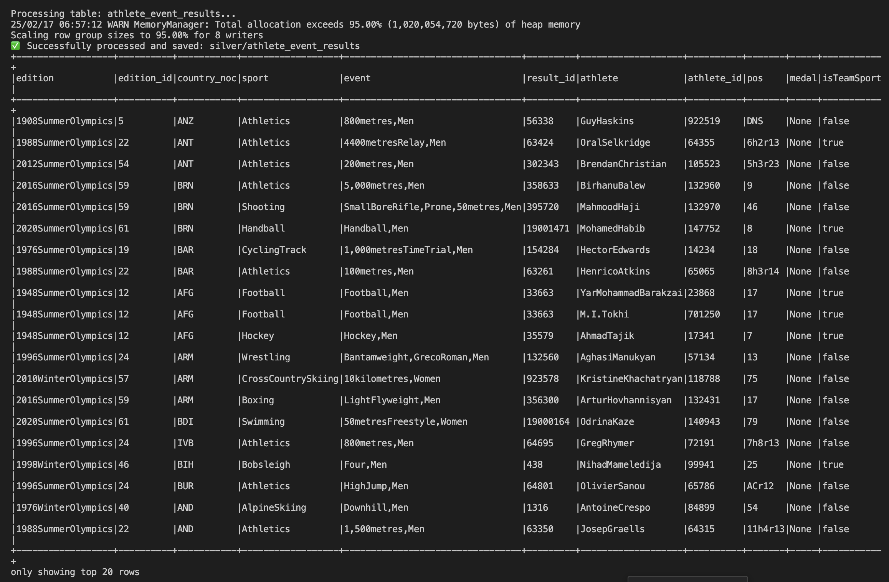
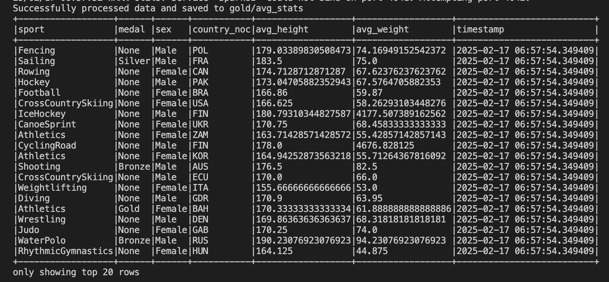
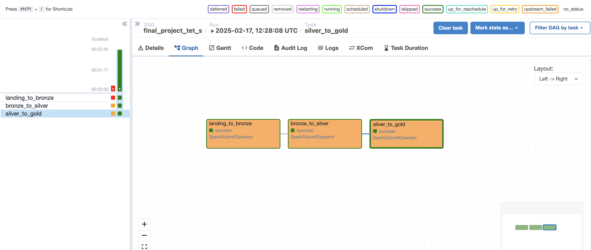

# goit-de-fp
The repository for the final project GoItNeo Data Engineering homework

## Task Description:

### Part One

1. Read the physical performance data of athletes using Spark from a MySQL table.

2. Filter the data.

3. Read competition results from a Kafka topic.

4. Merge the competition results from the Kafka topic with the biological data from the MySQL table.

5. Perform necessary data transformations.

6. Stream the transformed data (using the forEachBatch function) to:
a) an output Kafka topic,
b) a database.

### Part Two

1. Write the landing_to_bronze.py file. It should:

- Download a file from an FTP server in its original CSV format.
- Use Spark to read the CSV file and save it in Parquet format.

2. Write the bronze_to_silver.py file. It should:

- Read the bronze table.
- Apply a text-cleaning function to all text columns.
- Remove duplicate rows.
- Save the processed table to a folder.

3. Write the silver_to_gold.py file. It should:

- Read two tables from the silver layer.
- Perform merging and some transformations.
- Save the resulting table to a folder.

4. Write the project_solution.py file, which will contain an Airflow DAG that sequentially executes all three files.

## Task Results:

